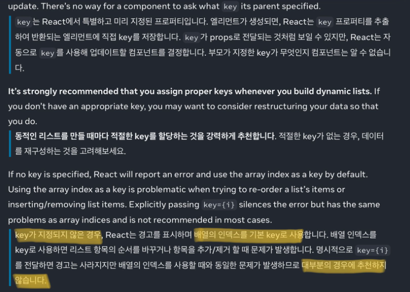

## 요약 및 정리

### 이벤트 네이밍

- 이벤트를 나타낼때(prop이름) : on[Event]
- 이벤트를 처리하는 함수(실제동작하는 함수) : handle[Event]

cf) 이벤트에 인수를 넘겨주고 싶으면 : onClick = { () ⇒ handleClick(prop)}

### 리스트의 key값

- 리스트 구성 시 형제들 사이에서 고유한 키값 지향
- 없으면 idx를 기본으로 (하지만 경고는 뜸)

## 새로 배운 것

- 리스트를 렌더링할 때, React는 렌더링된 각 리스트 항목에 대한 key값을 포함한 몇 가지 정보를 저장한다
- 리스트가 다시 렌더링되면, React는 각 리스트 항목의 key를 가져와서 이전 리스트의 항목에서 일치하는 key를 탐색한다

    1) 삭제 - 이전에 존재했는데 현재 없으면 컴포넌트 삭제

    2) 동일 - 이전값과 일치하면 pass

    - 컴포넌트의 state가 유지된다.

    3) 생성 - 이전에 존재하지 않거나, 이전 값이란 다르면 컴초넌트 생성

    - 컴포넌트의 state가 제거되고 새롭게 생성된다.
- 컴포넌트는 자신의 key를 모른다. 부모만 안다
