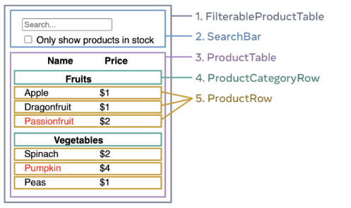

# Thinking in React : React로 사고하기

## 요약 및 정리

공문에서 react로 사고하는 방법을 step by step으로 설명한다

### Step1. UI를 컴포넌트 계층 구조로 나누기

- SRP : 컴포넌트는 이상적으로 한 가지 일만 수행해야 한다
- Design : 디자인의 레이어를 어떻게 구성할지 고려하자

예를 들어 위에 같은 데이터를 준다면 5개의 컴포넌트로 나눌 수 있다.

- 전체 앱(회색) - `FilterableProductTable`
    - 사용자의 입력 (파란색) - `SearchBar`
    - 사용자에 입력에 따라 보여지는 목록 (보라색) / 목록을 나눌 수도있음 - `ProductTable`
        - 각 카테고리의 제목 (녹색) - `ProductCategoryRow`
        - 각 상품들(노란색) - `ProductRow`

### Step2. 정적인 UI 만들기

컴포넌트 계층 구조를 나눈 후 상호작용을 배제하고 정적인 데이터로 UI 렌더링하는 컴포넌트를 작성한다

- 정적인 버전 ⇒ 상호작용 추가가 더 쉽다
- 정적인버전은 뇌를 비우고 할 수 있지만 상호작용은 뇌를 비우면 사고다

이러한 정적인 UI를 만들기 위해서 먼저

재사용하는 컴포넌트를 만들고 props를 이용해서 데이터를 전달한다 (state를 쓰지말고!)

- 정적인 버전은 props만 쓰고 state는 상호작용이 필요한 부분에서만 사용한다

top-down 방식과 bottom-up 방식이 있지만 작은 경우는 top-down이 큰 프로젝트 경우는 bottom-up이 쉽다

이렇게 state없이 최상위에서 props로 단방향 데이터 흐름을 가지고 있는 컴포넌트를 만든다. (JSX만을 반환하는 정적인 컴포넌트)

### Step3. 최소한의 완전한 UI State 찾기

> *state는 앱이 기억해야 하는 최소한의 변화하는 데이터 집합*
>

이제 state를 사용하는데 state를 구조화 할 때 가장 중요한 원칙은 DRY를 유지하는 것이다.  필요한 최소한의 state를 파악하고 그 외의 것들은 모두 필요할 때 계산한다

공문에서 state를 사용할지 고르는 기준점을 제시해준다.

1. 시간이 지나도 변하지 않는가? ⇒ Props
2. 부모로부터 전달되는가? ⇒ Props
3. 기존의 state나 props로 계산할 수 있는가? ⇒ Props
4. 위의 조건이 모두 아닌가? ⇒ State

<aside>
💡 Props VS State
props는 함수가 전달받은 인자와 같다
state는 컴포넌트의 메모리와 같다(정보를 추적하고 상요작용하여 변화할 수 있게 해준다.)

</aside>

### Step4. State의 위치 정하기

앱에서 최소한으로 필요한 state 데이터를 식별한 후 state를 소유할 컴포넌트를 식별해야 한다

이를 위한 논리 흐름도 제시해준다.

1. 해당 state를 기반으로 렌더링 하는 모든 컴포넌트 찾기
2. 가장 가까운 공통 상위 컴포넌트 찾기
3. 대부분의 경우 공통 상위 컴포넌트에 state를 둘 수 있다.
4. 혹은 공통 상위 컴포넌트보다 더 상위 또는 전역으로 관리할 수 있다.
5. 적절한 컴포넌트를 찾지 못했다면 새로운 컴포넌트를 만들어 공통 상위 컴포넌트의 상위에 추가한다

이렇게 state를 소유할 컴포넌트를 정했으면 사용하는 컴포넌트까지 props로 넘겨준다. (전역관리일때는 안 넘겨줘도 됨)

### Step5. 역방향 데이터 흐름 추가하기

데이터는 단방향으로 흐르지만 하위 컴포넌트의 이벤트로 인해 상위 컴포넌트의 state가 변경되는 경우가 있다 이러한 경우를 위해 역방향으로도 데이터가 흐를 수 있게 해야한다

이를 위해 state뿐만아니라 setState도 함께 props로 넘겨줌으로써 이벤트가 동작할 때 props로 받은 setState를 동작시킴으로 상위 컴포넌트의 state를 변경한다

## 새로 배운 것

### state로 만드는 기준

변하지 않고 && 부모로 부터 받지 않고 && 기존의 state나 props로 만들 수 없는 값 ⇒ state로 만듬

### state 위치 결정 기준

state가 사용되는 모든 컴포넌트의 공통 부모

+ 근데 props drilling을 피하기 위해 전역 상태관리를 사용하거나 합성 컴포넌트를 쓰는게 좋은데 이를 사용하기 위한 기준을 찾아보자

ex) 은수 멘토님께서 말씀해주신 전역 상태관리 도입을 위한 5단계

## 회고

그냥 감으로만 하고 정확한 기준 없이 state의 위치를 정한 후 감으로 옮겼던 지난 날을 반성하게 되었다… 정신을 채리자!
